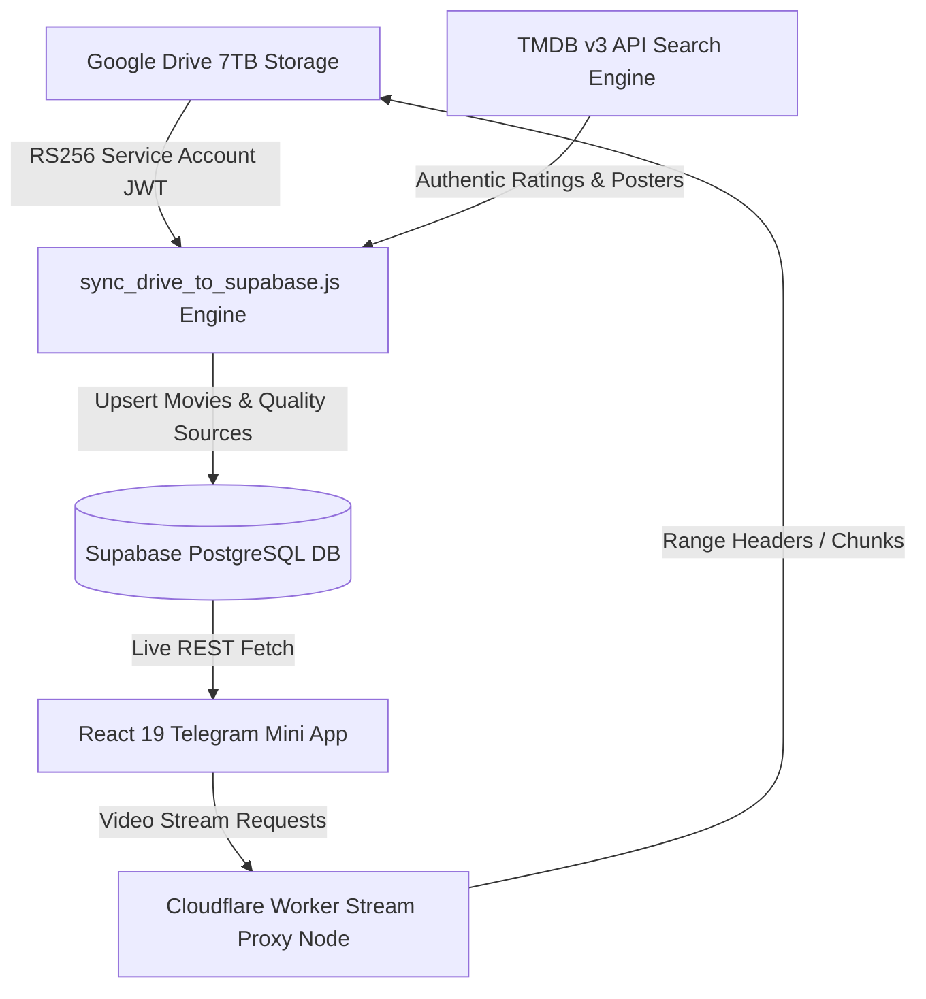

# 🎬 SMD PRIME — Telegram Mini App (TMA) Mobile Cinema Platform

> **Production-grade mobile streaming Single Page Application (SPA)** built with React 19, Vite, Supabase, Cloudflare Workers, and Google Drive API v3. Delivers high-definition cinema streams with authentic TMDB ratings and high-resolution posters.

---

## 🏗️ System Architecture



---

## 📁 Before vs. After Codebase Structure

### ❌ Before Cleanup (Legacy & Redundant Files)
```text
SMD PRIME/
├── run_sync.js                  (Redundant 1-line wrapper)
├── sync_library.js              (Legacy sync script)
├── sync_drive_to_supabase.js    (Unstructured sync logic)
├── test_tmdb.py                 (Unused python scratch file)
├── src/
│   ├── data/
│   │   └── movies.json          (Legacy mock data)
│   ├── utils/
│   │   └── supabaseClient.js    (Duplicate client file)
│   └── ...
```

### ✅ After Cleanup (Modular, Clean & Production-Ready)
```text
SMD PRIME/
├── .env.example                 # Environment configuration template
├── package.json                 # Standardized npm scripts & dependencies
├── README.md                    # System documentation & CLI guide
├── sync_drive_to_supabase.js    # Core Google Drive -> TMDB -> Supabase sync engine
├── auto_sync.js                 # 60s background polling auto-sync daemon
├── worker_sync.js               # Cloudflare Worker serverless proxy & webhook handler
├── test_credentials.js          # CLI 4-service credentials health diagnostic suite
├── test_tmdb_sync.js            # CLI Supabase database TMDB audit test suite
├── index.html                   # Mobile SPA HTML entry point
├── vite.config.js               # Vite build configuration
└── src/
    ├── App.jsx                  # Main React SPA component & navigation state
    ├── main.jsx                 # React DOM mount point
    ├── index.css                # Global Tailwind CSS directives & custom styles
    ├── supabaseClient.js        # Centralized Supabase client & live query formatter
    ├── components/
    │   ├── Header.jsx           # Top navigation bar & dark mode toggle
    │   ├── HeroBanner.jsx       # Featured movie hero banner overlay
    │   ├── MovieCard.jsx        # Mobile poster card with rating badge & hover play
    │   ├── MovieModal.jsx       # Detailed movie sheet modal & quality selector
    │   ├── MovieRow.jsx         # Horizontal carousel row container
    │   ├── SearchOverlay.jsx    # Real-time search modal & genre filters
    │   └── VideoPlayer.jsx      # VLC-style custom HTML5 video player component
    └── utils/
        ├── posters.js           # High-definition ISP-resilient poster repository
        ├── proxy.js             # Cloudflare Worker video stream URL builder
        ├── telegram.js          # Telegram Mini App Haptic Feedback & BackButton hooks
        └── tmdb.js              # TMDB API v3 fetch engine with IPv4 DNS optimization
```

---

## 🧹 Migration & Refactoring Summary

1. **Purged Dead Code & Legacy Assets**:
   - Removed `test_tmdb.py` (unused python file).
   - Removed `sync_library.js` and `run_sync.js` (consolidated into `sync_drive_to_supabase.js`).
   - Removed `src/utils/supabaseClient.js` (eliminated duplicate, standardized on `src/supabaseClient.js`).
   - Removed `src/data/movies.json` (purged local mock data to enforce 100% live database streaming).

2. **Standardized Naming & DX**:
   - PascalCase for React components (`VideoPlayer.jsx`, `MovieCard.jsx`).
   - camelCase for utility functions (`supabaseClient.js`, `posters.js`).
   - Standardized CLI scripts in `package.json` for seamless onboarding.

---

## 💻 Developer Command-Line (CLI) Guide

### 1. Installation & Dependency Setup
```bash
# Clone repository and install dependencies
npm install
```

### 2. Environment Setup
```bash
# Copy template and edit environment variables
cp .env.example .env
```

### 3. Verify Environment & Credentials
```bash
# Run 4-service credentials diagnostic check (Supabase, Cloudflare, TMDB, Google Drive)
npm run test:credentials
```

### 4. Run Google Drive to Supabase Content Sync
```bash
# Execute standard manual sync pass
npm run sync

# Run continuous 60s background polling auto-sync daemon
npm run sync:auto
```

### 5. Audit Supabase Database TMDB Data
```bash
# Verify non-mock TMDB ratings and valid poster URLs in Supabase
npm run test:audit
```

### 6. Development Server
```bash
# Launch Vite development server (Access at http://localhost:3000)
npm run dev
```

### 7. Code Formatting & Production Build
```bash
# Run oxlint linter
npm run lint

# Compile production bundle
npm run build

# Preview production build locally
npm run preview
```
